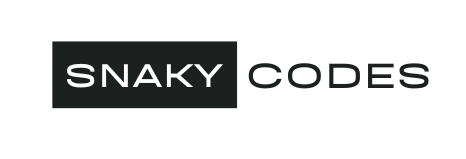

  
   

  <h3><b>Portfolio using Bootstap</b></h3>

# 📗 Table of Contents

- [📖 About the Project](#about-project)
  - [🛠 Built With](#built-with)
    - [Tech Stack](#tech-stack)
    - [Key Features](#key-features)
  - [🚀 Live Demo](#live-demo)
- [👥 Authors](#authors)
- [🔭 Future Features](#future-features)
- [🤝 Contributing](#contributing)
- [⭐️ Show your support](#support)
- [🙏 Acknowledgements](#acknowledgements)
- [❓ FAQ (OPTIONAL)](#faq)
- [📝 License](#license)

# 📖 Portfolio 

**Portfolio** is a website designed to showcase my skills and projects.

## 🛠 Built With 

### Tech Stack 

  
Client

  <ul>
    <li><a href="https://developer.mozilla.org/en-US/docs/Web/HTML">HTML</a></li>
    <li><a href="https://developer.mozilla.org/en-US/docs/Web/CSS">CSS</a></li>
    <li><a href="https://getbootstrap.com/">Bootstrap</a></li>
  </ul>

### Key Features 

- **My Introduction**
- **Links to my Projects**
- **Link to my Resume**

(<a href="#readme-top">back to top</a>)

## 🚀 Live Demo 

- Coming soon

(<a href="#readme-top">back to top</a>)

## 👥 Authors 

👤 **Soban Syeed**

- GitHub: [@SnakyMz](https://github.com/SnakyMz)
- Twitter: [@SobanSyeed](https://twitter.com/SobanSyeed)
- LinkedIn: [Soban Syeed](https://www.linkedin.com/in/soban-syeed-82985b241/)

👤 **Andoh Francis**

- GitHub: [@CobbyElsonfx](https://github.com/CobbyElsonfx)
- LinkedIn: [Andoh Francis](https://www.linkedin.com/in/andoh-francis-133aa7245/)

(<a href="#readme-top">back to top</a>)

## 🔭 Future Features 

- [ ] **Working Projects section**
- [ ] **Working Skills section**
- [ ] **Custom Logo**

(<a href="#readme-top">back to top</a>)

## 🤝 Contributing 

Contributions, issues, and feature requests are welcome!

Feel free to check the [issues page](../../issues/).

(<a href="#readme-top">back to top</a>)

## ⭐️ Show your support 

If you like this project please send me your feedback.

(<a href="#readme-top">back to top</a>)

## 🙏 Acknowledgments 

I would like to thank Microverse.

(<a href="#readme-top">back to top</a>)

## ❓ FAQ (OPTIONAL) 

- **Where did you get the templates for the website?**

  - Bootstap

- **Will you include javascript?**

  - Maybe

(<a href="#readme-top">back to top</a>)

## 📝 License 

This project is [MIT](./LICENSE) licensed.

(<a href="#readme-top">back to top</a>)
